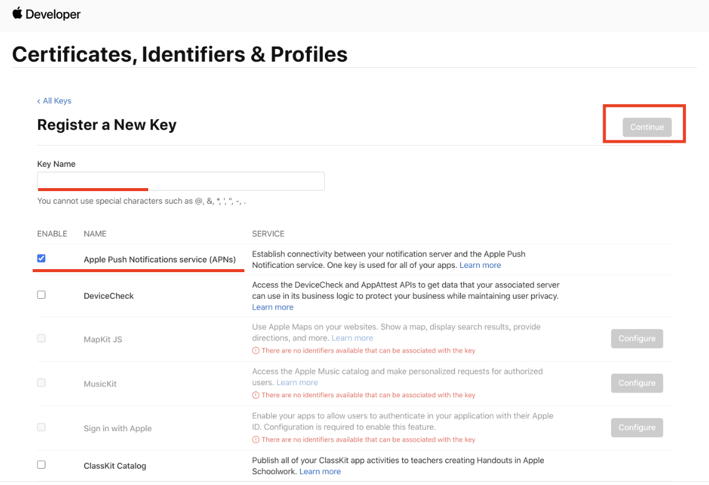
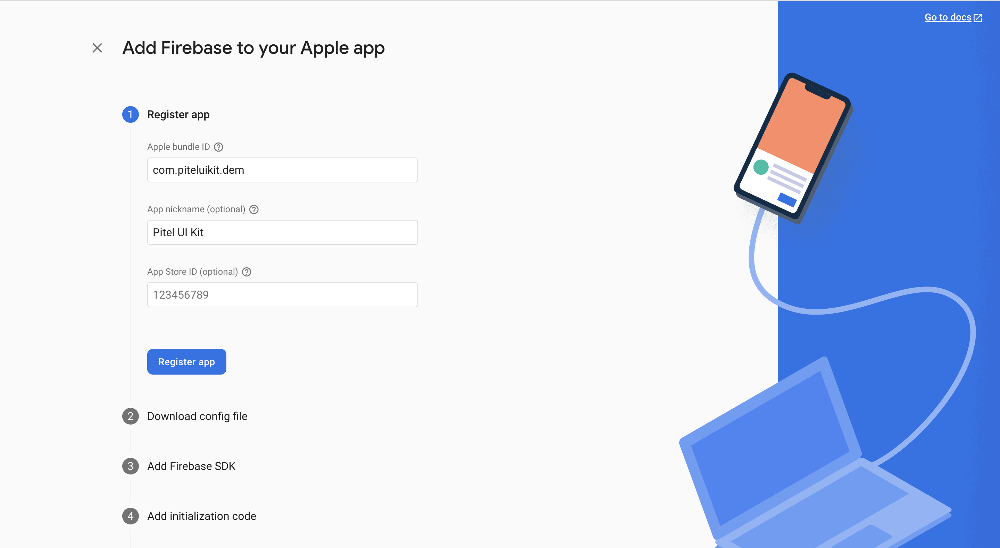
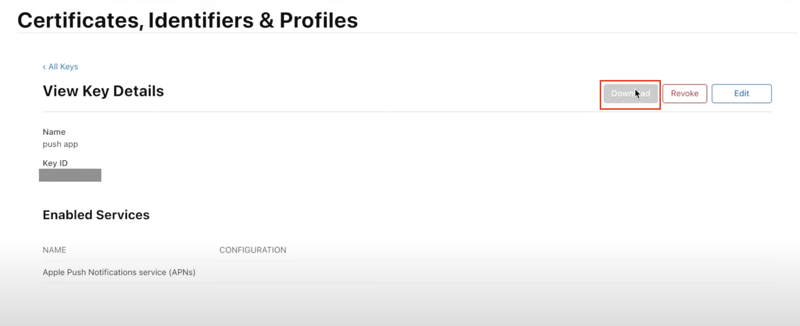
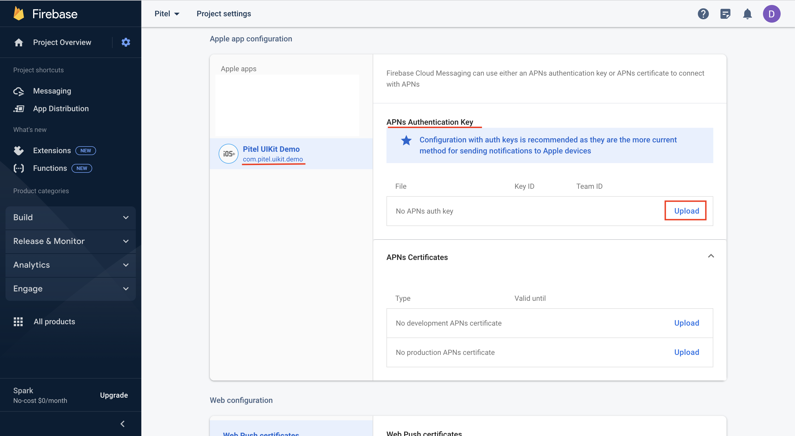
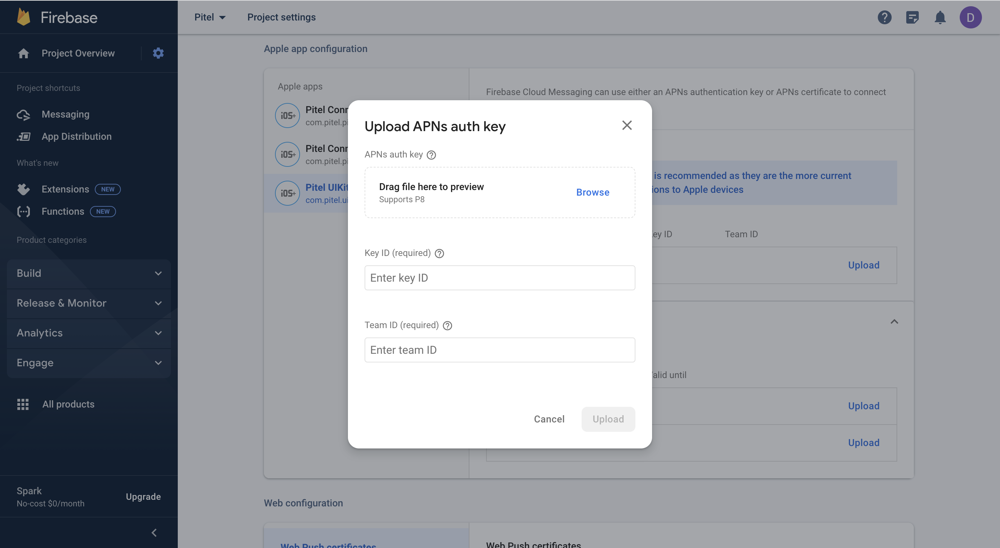

# Pitel Voip Push notification
> **Warning**
> IOS only working on real device, not on simulator (Callkit framework not working on simulator)
# Setup & Certificate
#### IOS
If you are making VoIP application than you definitely want to update your application in the background & terminate state as well as wake your application when any VoIP call is being received.

**1. Create Apple Push Notification certificate.**
- Access [https://developer.apple.com/account/resources/identifiers/list](https://developer.apple.com/account/resources/identifiers/list)
- In [Certificates, Identifiers & Profiles](https://developer.apple.com/account/resources), click Certificates in the sidebar.
- On the top left, click the add button (+).The certificate type should be Apple Push Notification service SSL (Sandbox & Production) under Services.


**2. Choose an App ID from the pop-up menu, then click Continue.**


**3. Upload Certificate Signing Request → Continue**


Follow the instructions to [create a certificate signing request](https://developer.apple.com/help/account/create-certificates/create-a-certificate-signing-request).

- **Install certificate.**
Download the certificate and install it into the Keychain Access app(download .cer and double click to install).
    
- **Export the .p12 file and send it to Tel4vn (or using test)**


# Setup Pushkit & Callkit
#### IOS
- Open Xcode Project → Capabilities
- In Tab Signing & Capabilities. Enable Push notifications & Background Modes


- Create APNs key and upload in firebase project. In your apple developer account.

- Upload APNs key to your firebase
    - Create new your IOS App in Firebase project.
    
    - Download file .p8 to upload to firebase
    
    - Select IOS app -> upload Apns key
    
    - Fill information in upload Apns key popup
    

#### Android
Using FCM (Firebase Cloud Message) to handle push notification wake up app when app run on Background or Terminate
> **Warning**
> Popup request permission only working with targetSdkVersion >= 33

- Access link [https://console.firebase.google.com/u/0/project/_/notification](https://console.firebase.google.com/u/0/project/_/notification)
- Create your packageId for android app

- Download & copy file google_service.json -> replace file google_service.json in path: ```android/app/google_service.json```

- Go to Project Setting → Cloud Messaging → Enable Cloud Messaging API (Legacy)


> **Note**
> After complete all step Setup. Please send information to dev of Tel4vn, about:
> - Bunlde/package Id: example com.company.app
> - File certificate .p12 for IOS.
> - Server key for Android

# Installation (your project)
- Install Packages

```xml
flutter pub add flutter_callkit_incoming
```

- Add pubspec.yaml:
```xml
dependencies:
      flutter_callkit_incoming: any
```
**Config your project**
- Android
In android/app/src/main/AndroidManifest.xml
```xml
<manifest...>
     ...
     <!-- 
         Using for load image from internet
     -->
     <uses-permission android:name="android.permission.INTERNET"/>
 </manifest>
```

- IOS
In ios/Runner/Info.plist
```xml
<key>UIBackgroundModes</key>
<array>
    <string>processing</string>
    <string>remote-notification</string>
    <string>voip</string>
</array>
```

Replace your file ios/Runner/AppDelegate.swift with

[https://github.com/tel4vn/pitel-ui-kit/blob/dev/ios/Runner/AppDelegate.swift](https://github.com/tel4vn/pitel-ui-kit/blob/dev/ios/Runner/AppDelegate.swift)

## **Usage**
- Before handle Incoming call, you should import package in home screen
```dart
import 'package:plugin_pitel/voip_push/push_notif.dart';
import 'package:plugin_pitel/voip_push/voip_notif.dart';
```
- Get device push token VoIP. 
```dart
void _getDeviceToken() async {
    final deviceToken = await PushVoipNotif.getDeviceToken();
    print(deviceToken);
  }
```
- Get fcm token VoIP. 
```dart
void _getFcmToken() async {
    final fcmToken = await PushVoipNotif.getFcmToken();
    print(fcmToken);
  }
```
- Register device token after user login success
```dart
void _registerDeviceToken() async {
    final fcmToken = await PushVoipNotif.getFCMToken();
    final response = await pitelClient.registerDeviceToken(
      deviceToken:
          '56357b057da09ba1c8a069c06a0f0232f7a1d80bf743f757c290a20b42dce55c',
      platform: 'ios',
      bundleId: 'com.pitel.uikit.demo',     // BundleId/packageId
      domain: 'mobile.tel4vn.com',
      extension: '101',
      appMode: kReleaseMode ? 'production' : 'dev', // check APNs certificate of Apple run production or dev mode
      fcmToken: fcmToken,
    );
  }
```
- Remove Device toke  when user logout success
```dart
    void _removeDeviceToken() async {
        final response = await pitelClient.removeDeviceToken(
          deviceToken:
          '56357b057da09ba1c8a069c06a0f0232f7a1d80bf743f757c290a20b42dce55c', // Device token
          domain: 'mobile.tel4vn.com',
          extension: '101',
      );
  }
  
    void _logout() {
        _removeDeviceToken();      // Remove device token
        pitelCall.unregister();    // Disconnect SIP call when user logout
  }
```
- Listen events from Push notification for wake up app (top level function. Example app.dart)
```dart
final pitelService = PitelServiceImpl();
final PitelCall pitelCall = PitelClient.getInstance().pitelCall;
  
@override
  void initState() {
    super.initState();
    VoipNotifService.listenerEvent(
      callback: (event) {},
      onCallAccept: () {
        //! Re-register when user accept call
        handleRegister();
      },
      onCallDecline: () {},
      onCallEnd: () {
        pitelCall.hangup();
      },
    );
  }
```

## How to test
- Download & install app from link https://github.com/onmyway133/PushNotifications/releases


- Fill information and click Send to Test Push Notification

Note: Add .voip after your bundleId to send voip push notification

Example: 
```
Your app bundleId: com.pitel.uikit.demo
Voip push Bundle Id: com.pitel.uikit.demo.voip
```
- IOS


- Android: using above app or test from Postman

cURL

```dart
curl --location 'https://fcm.googleapis.com/fcm/send' \
--header 'Content-Type: application/json' \
--header 'Authorization: key=${server_key}' \
--data '{
    "registration_ids": [${device_token}],
    "data":{
        "uuid": "call_id",
        "nameCaller": "Anh Quang",
        "avatar": "Anh Quang",
        "phoneNumber": "0341111111",
        "appName": "Pitel Connnect"
    },
    "content_available": true,
    "priority": "high"
}'
```
