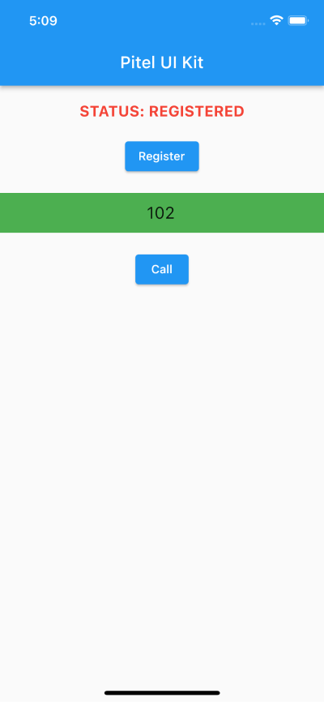
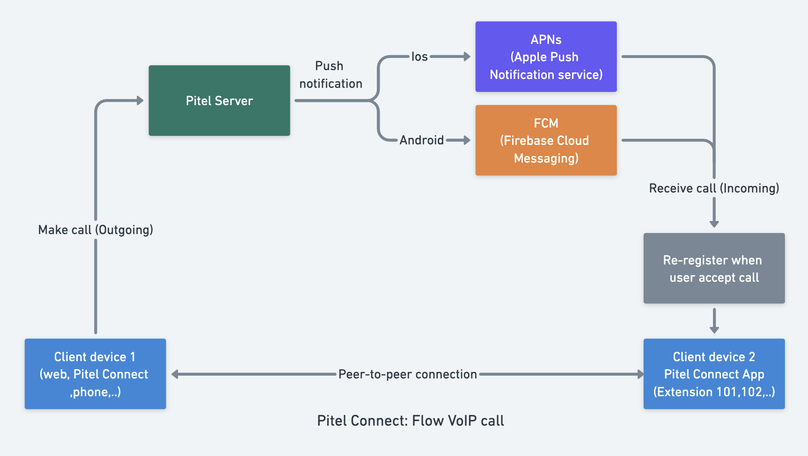

##### flutter_pitel_voip

# Integrate VoIP call to your project

[](https://documents.tel4vn.com/)

`flutter_pitel_voip` is package support for voip call.

## Demo




## Pitel Connect Flow

When user make call from Pitel Connect app, Pitel Server pushes a notification for all user login (who receives the call). When user "Accept" call, extension will re-register to receive call.


## Features

- Register Extension
- Call
- Hangup
- Turn on/off micro
- Turn on/of speaker

## Installation

1. Install Packages

- Run this command:

```dart
flutter pub add flutter_pitel_voip
```

- Or add pubspec.yaml:

```pubspec.yaml
flutter_pitel_voip: any
```

2. Get package

```
flutter pub get
```

3. Import

```
import 'package:flutter_pitel_voip/flutter_pitel_voip.dart';
```

4. Configure Project

- In file app.dart config easyloading

```dart
import 'package:flutter_easyloading/flutter_easyloading.dart';

  // ....
  return MaterialApp.router(
    // ...
    builder: EasyLoading.init(),
  )
```

#### Android:

- In file `android/app/src/main/AndroidManifest.xml`

```xml
 <manifest...>
    ...
    // Request permission
    <uses-permission android:name="android.permission.INTERNET" />
    <uses-permission android:name="android.permission.ACCESS_NETWORK_STATE" />
    <uses-permission android:name="android.permission.RECORD_AUDIO" />
    <uses-permission android:name="android.permission.MODIFY_AUDIO_SETTINGS"/>
    <uses-permission android:name="android.permission.CAMERA" />
    <uses-permission android:name="android.permission.SYSTEM_ALERT_WINDOW" />
    <uses-permission android:name="android.permission.FOREGROUND_SERVICE"/>
 </manifest>
```

#### IOS

- Request permission in file `Info.plist`

```
<key>NSMicrophoneUsageDescription</key>
<string>Use microphone</string>
<key>UIBackgroundModes</key>
<array>
	<string>fetch</string>
	<string>processing</string>
	<string>remote-notification</string>
	<string>voip</string>
</array>
```

- Make sure platform ios `12.0` in `Podfile`

```
platform :ios, '12.0'
```

5. Pushkit/ Push notification - Received VoIP and Wake app from Terminated State.
   > **Note**
   > Please check [PUSH_NOTIF.md](https://github.com/tel4vn/flutter-pitel-voip/blob/main//PUSH_NOTIF.md). setup Pushkit (for IOS), push notification (for Android).

## Troubleshooting

[Android only]: If you give a error flutter_webrtc when run app in android. Please update code in file

```
$HOME/.pub-cache/hosted/pub.dartlang.org/flutter_webrtc-{version}/android/build.gradle
```

```xml
dependencies {
  // Remove
  // implementation 'com.github.webrtc-sdk:android:104.5112.03'

  // Replace
  implementation 'io.github.webrtc-sdk:android:104.5112.09'
}
```

## Example

Please checkout repo github to get [example](https://github.com/tel4vn/pitel-ui-kit/tree/1.0.7)

## Usage

- In file `app.dart`, Wrap MaterialApp with PitelVoip widget
  Please follow [example](https://github.com/tel4vn/pitel-ui-kit/blob/main/lib/app.dart)

> Note: handleRegisterCall, handleRegister, registerFunc in [here](https://github.com/tel4vn/pitel-ui-kit/blob/main/lib/app.dart)

```dart
Widget build(BuildContext context) {
    return PitelVoip(                           // Wrap with PitelVoip
      handleRegister: handleRegister,           // Handle register
      handleRegisterCall: handleRegisterCall,   // Handle register call
      child: MaterialApp.router(
        ...
      ),
    );
  }
```

- In file `home_screen.dart`.
  Please follow [example](https://github.com/tel4vn/pitel-ui-kit/blob/main/lib/features/home/home_screen.dart).
  Add WidgetsBindingObserver to handle AppLifecycleState change

```dart
...
Widget build(BuildContext context) {
    return PitelVoipCall(
        // Wrap with PitelVoipCall
        bundleId: '${bundle_id}',
        appMode: 'dev', // dev or production
        sipInfoData: sipInfoData,
        goBack: () {
            // go back function
        },
        goToCall: () {
            // go to call screen
        },
        onCallState: (callState) {
            // IMPORTANT: Set callState to your global state management. Example: bloc, getX, riverpod,..
            // Example riverpod
            // ref.read(callStateController.notifier).state = callState;
        },
        onRegisterState: (String registerState) {
            // get Register Status in here
        },
      child: ...,
    );
  }
```

#### Properties

| Prop            | Description                     | Type                      | Default  |
| --------------- | ------------------------------- | ------------------------- | -------- |
| bundleId        | bundleId IOS, packageId android | String                    | Required |
| appMode         | debug mode or release mode      | String                    | Required |
| sipInfoData     | SIP information data            | () {}                     | Required |
| goBack          | goback navigation               | () {}                     | Required |
| goToCall        | navigation, go to call screen   | () {}                     | Required |
| onCallState     | set call status                 | (callState) {}            | Required |
| onRegisterState | get extension register status   | (String registerState) {} | Required |
| child           | child widget                    | Widget                    | Required |

Register extension from data of Tel4vn provide. Example: 101, 102,… Create 1 button to fill data to register extension.

```dart
ElevatedButton(
        onPressed: () asyns {
          final PushNotifParams pushNotifParams = PushNotifParams(
            teamId: '${apple_team_id}',
            bundleId: '${bundle_id}',
          );
          final sipInfoData = SipInfoData.fromJson({
            "authPass": "${Password}",
            "registerServer": "${Domain}",
            "outboundServer": "${Outbound Proxy}",
            "port": PORT,
            "accountName": "${UUser}",      // Example 101
            "displayName": "${Display Name}",
            "wssUrl": "${URL WSS}",
            "apiDomain": "${URL API}"
          });

          final pitelClient = PitelServiceImpl();
          final pitelSetting = await pitelClient.setExtensionInfo(sipInfoData, pushNotifParams);
          // IMPORTANT: Set pitelSetting to your global state management. Example: bloc, getX, riverpod,..
          // Example riverpod
          // ref.read(pitelSettingProvider.notifier).state = pitelSettingRes;
        },
        child: const Text("Register"),),
```

- Logout extension

```dart
pitelClient.logoutExtension(sipInfoData);
```

- In file `call_screen.dart`
  [Example](https://github.com/tel4vn/pitel-ui-kit/blob/main/lib/features/call_screen/call_page.dart)

```dart
import 'package:flutter/material.dart';
import 'package:flutter_pitel_voip/flutter_pitel_voip.dart';
class CallPage extends StatelessWidget {
  const CallPage({super.key});
  @override
  Widget build(BuildContext context) {
    // IMPORTANT: Get callState from your global state management. Example: bloc, getX, riverpod,..
    // Example riverpod
    // final callState = ref.watch(callStateController);

    return CallScreen(
      callState: callState, // callState from state management you set before
      goBack: () {
        // Call your go back function in here
      },
      bgColor: Colors.cyan,
    );
  }
}
```

#### Properties

| Prop               | Description                          | Type      | Default  |
| ------------------ | ------------------------------------ | --------- | -------- |
| goBack             | go back navigation                   | () {}     | Required |
| bgColor            | background color                     | Color     | Required |
| txtMute            | Text display of micro mute           | String    | Optional |
| txtUnMute          | Text display of micro unmute         | String    | Optional |
| txtSpeaker         | Text display speaker                 | String    | Optional |
| txtOutgoing        | Text display direction outgoing call | String    | Optional |
| txtIncoming        | Text display direction incoming call | String    | Optional |
| textStyle          | Style for mic/speaker text           | TextStyle | Optional |
| titleTextStyle     | Style for display phone number text  | TextStyle | Optional |
| timerTextStyle     | Style for timer text                 | TextStyle | Optional |
| directionTextStyle | Style for direction text             | TextStyle | Optional |

- Outgoing call

```dart
pitelCall.outGoingCall(
  phoneNumber: "",
  handleRegisterCall: (){},
);
```

#### Properties

| Prop               | Description               | Type   | Default  |
| ------------------ | ------------------------- | ------ | -------- |
| phoneNumber        | phone number for call out | String | Required |
| handleRegisterCall | re-register when call out | () {}  | Required |
| nameCaller         | set name caller           | String | Optional |

## How to test

Using tryit to test voip call connection & conversation
Link: https://tryit.jssip.net/
Setting:

1. Access to link https://tryit.jssip.net/
2. Enter extension: example 102
3. Click Setting icon
4. Enter information to input field
   
5. Save
6. Click icon -> to connect
