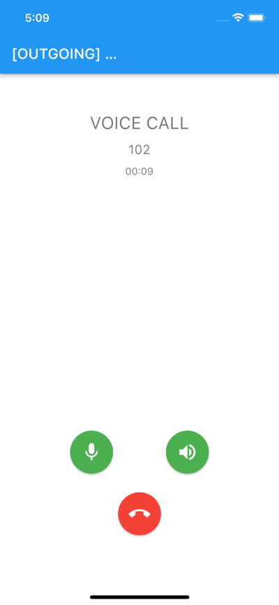

##### plugin_pitel
# Integrate Voip call to your project

[](https://documents.tel4vn.com/)

```plugin_pitel``` is package support for voip call.

## Demo



## Features
- Register Extension
- Call
- Hangup
- Turn on/off micro
- Turn on/of speaker

## Installation
1. Install Packages 
Add pubspec.yaml:
```pubspec.yaml
plugin_pitel:
    git:
      url: https://{{Personal Access Token}}@github.com/tel4vn/flutter-pitel-voip.git
      ref: 1.0.2 # package version
```
[Create Personal Access Token](https://docs.github.com/en/enterprise-server@3.4/authentication/keeping-your-account-and-data-secure/creating-a-personal-access-token)

2. Get package
```
flutter pub get
```
3. Configure Project
#### Android:
- In file ```android/app/src/main/AndroidManifest.xml```
```xml
 <manifest...>
    ...
    // Request permission
    <uses-permission android:name="android.permission.INTERNET" />
    <uses-permission android:name="android.permission.ACCESS_NETWORK_STATE" />
    <uses-permission android:name="android.permission.RECORD_AUDIO" />
    <uses-permission android:name="android.permission.MODIFY_AUDIO_SETTINGS"/>
    <uses-permission android:name="android.permission.CAMERA" />
    <uses-permission android:name="android.permission.SYSTEM_ALERT_WINDOW" />
    <uses-permission android:name="android.permission.FOREGROUND_SERVICE"/>
 </manifest>
```

#### IOS
- Request permission in file ```Info.plist```
```
<key>NSCameraUsageDescription</key>
<string>This app needs camera access to scan QR codes</string>
<key>NSMicrophoneUsageDescription</key>
<string>Use microphone</string>
<key>UIBackgroundModes</key>
<array>
	<string>external-accessory</string>
	<string>fetch</string>
	<string>processing</string>
	<string>remote-notification</string>
	<string>voip</string>
</array>
```
- Make sure platform ios ```12.0``` in ```Podfile```
```
platform :ios, '12.0'
```
4. Pushkit - Received VoIP and Wake app from Terminated State (only for IOS).

Please check [PUSH_NOTIF.md](https://github.com/tel4vn/flutter-pitel-voip/blob/main/PUSH_NOTIF.md). setup Pushkit for IOS

## Usage
#### Implement SipPitelHelperListener
In your Home screen, please implement SipPitelHelperListener to use plugin_pitel
```dart
class HomeScreen extends StatefulWidget {
  final PitelCall _pitelCall = PitelClient.getInstance().pitelCall;
  HomeScreen({Key? key}) : super(key: key);

  @override
  State<HomeScreen> createState() => _MyHomeScreen();
}

class _MyHomeScreen extends State<HomeScreen>
    implements SipPitelHelperListener {    // Implement SipPitelHelperListener in here
    PitelClient pitelClient = PitelClient.getInstance();
    PitelCall get pitelCall => widget._pitelCall;
    ...
}
```
#### Register extension
Register extension from data of Tel4vn provide. Example: 101, 102,…

```dart
import 'package:plugin_pitel/services/sip_info_data.dart';
```

- Create 1 button to fill data to register extension.
```dart
ElevatedButton(
        onPressed: () {
          final sipInfo = SipInfoData.fromJson({
            "authPass": "${Password}",
            "registerServer": "${Domain}",
            "outboundServer": "${Outbound Proxy}",
            "userID": UUser,                // Example 101
            "authID": UUser,                // Example 101
            "accountName": "${UUser}",      // Example 101
            "displayName": "${UUser}@${Domain}",
            "dialPlan": null,
            "randomPort": null,
            "voicemail": null,
            "wssUrl": "${URL WSS}",
            "userName": "${username}@${Domain}",
            "apiDomain": "${URL API}"
          });

          final pitelClient = PitelServiceImpl();
          pitelClient.setExtensionInfo(sipInfo);
        },
        child: const Text("Register"),),
```
- Register status
```dart
@override
  void registrationStateChanged(PitelRegistrationState state) {
    switch (state.state) {
      case PitelRegistrationStateEnum.REGISTRATION_FAILED:
        goBack();
        break;
      case PitelRegistrationStateEnum.NONE:
      case PitelRegistrationStateEnum.UNREGISTERED:
      case PitelRegistrationStateEnum.REGISTERED:
        setState(() {
          receivedMsg = 'REGISTERED';
        });
        break;
    }
  }
```

#### Initialize call screen
- Initialize state & listener function
```dart
    @override
    initState() {
        super.initState();
        pitelCall.addListener(this);
        _initRenderers();
    }
    
    // INIT: Initialize Pitel
    void _initRenderers() async {
        await pitelCall.initializeLocal();
        await pitelCall.initializeRemote();
    }
```
- Dispose & Deactive function
```dart
  // Dispose pitelcall
  void _disposeRenderers() {
    pitelCall.disposeLocalRenderer();
    pitelCall.disposeRemoteRenderer();
  }
  // Deactive When call end
  @override
  deactivate() {
    super.deactivate();
    _handleHangup();
    pitelCall.removeListener(this);
    _disposeRenderers();
  }
```
- Hangup function
```dart
  // Handle hangup and reset timer
  void _handleHangup() {
    pitelCall.hangup();
  }
```
- Accept call function
```dart
  // Handle accept call
  void _handleAccept() {
    pitelCall.answer();
  }
```
- Listen state function
```dart
  // STATUS: Handle call state
  @override
  void callStateChanged(String callId, PitelCallState callState) {
    setState(() {
        // setState for callState
      _state = callState.state;
    });
    switch (callState.state) {
      case PitelCallStateEnum.HOLD:
      case PitelCallStateEnum.UNHOLD:
        break;
      case PitelCallStateEnum.MUTED:
      case PitelCallStateEnum.UNMUTED:
        break;
      case PitelCallStateEnum.STREAM:
        break;
      case PitelCallStateEnum.ENDED:
      case PitelCallStateEnum.FAILED:
        _backToDialPad();
        break;
      case PitelCallStateEnum.CONNECTING:
      case PitelCallStateEnum.PROGRESS:
      case PitelCallStateEnum.ACCEPTED:
      case PitelCallStateEnum.CONFIRMED:
      case PitelCallStateEnum.NONE:
      case PitelCallStateEnum.CALL_INITIATION:
      case PitelCallStateEnum.REFER:
        break;
    }
  }
```

## Example
Please checkout repo github to get [example](https://github.com/tel4vn/pitel-ui-kit)

## How to test
Using tryit to test voip call connection & conversation
Link: https://tryit.jssip.net/
Setting: 
1. Access to link https://tryit.jssip.net/
2. Enter extension: example 102
3. Click Setting icon
4. Enter information to input field

5. Save
6. Click icon -> to connect

